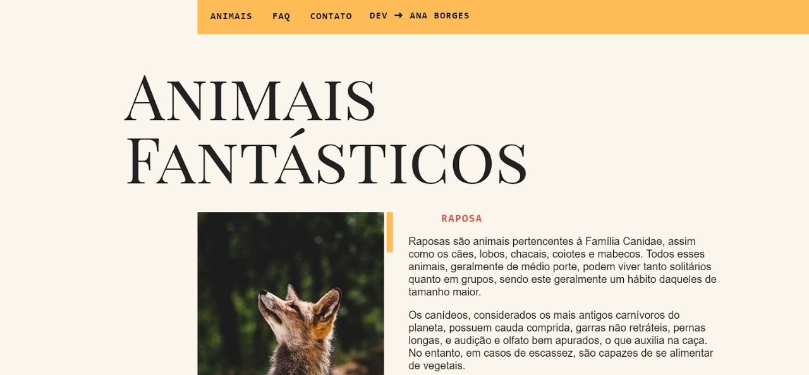

# 🐾 Animais Fantásticos



Projeto desenvolvido para praticar JavaScript, manipulação do DOM e conceitos básicos de acessibilidade.

## 📚 Sobre

O **Animais Fantásticos** é um site interativo que exibe informações de animais conforme o usuário interage com a página. É ensinado no curso da Origamid e foi criado com foco no aprendizado de:

- JavaScript Vanilla
- HTML e CSS
- DOM (Document Object Model)
- Eventos e animações

## 🚀 Tecnologias utilizadas

- HTML5
- CSS3
- JavaScript (ES6)

## 🖥️ Funcionalidades

- Lista interativa de animais
- Animações suaves ao clicar nos elementos
- Conteúdo acessível
- Script organizado e reutilizável

## 💡 Como executar

Você pode clonar o repositório com:

```bash
git clone https://github.com/ajborgesdev/animais-fantasticos.git
